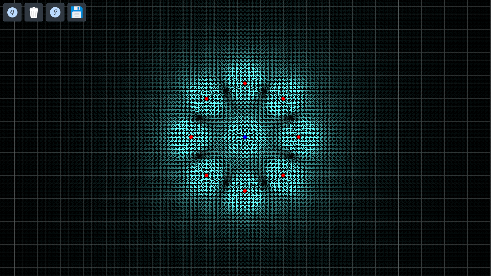

# didactic-emfield
didactic-emfield is an electromagnetic field simulator designed to aid in understanding how different point charges interact in a two-dimensional space by visualizing the electromagnetic fields caused by them.

